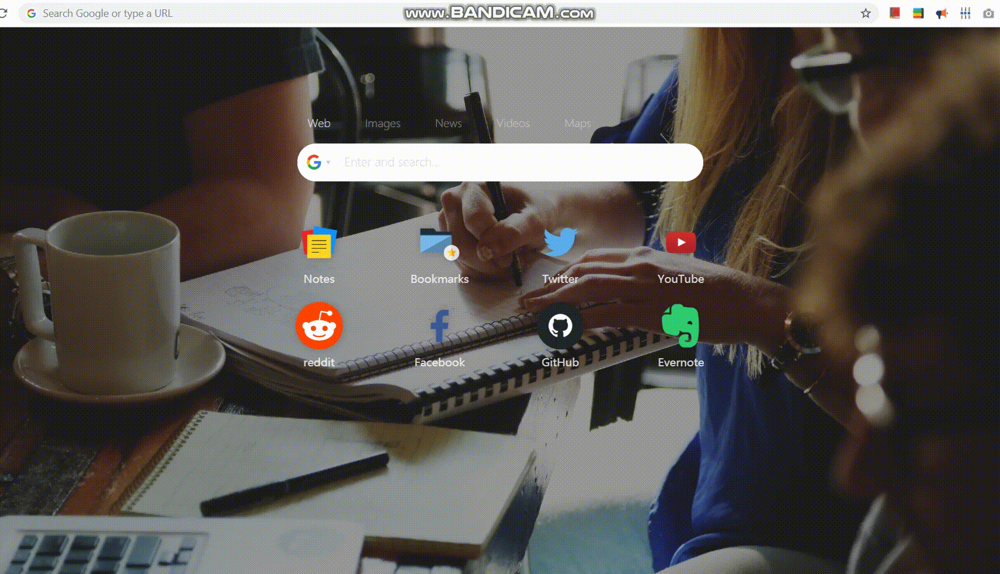

# RESTful API example application

This is a bare-bones example of a Flask application providing a RESTful API for a campaign resource.

The entire application is contained within the `app.py` file.
# Prequisites

Must have python3.6+ installed.

## Install

* Choose one of the following methods:
    - *Installing in closed environment (Recommended)*:
      - Install pipenv through pip.  
      ` pip install pipenv`
      
      - Open the task folder in terminal and install dependencies.  
      ` pipenv install `
    - *Installing globally*:
        - Open the task folder in terminal and run:  
        ` pip install -r requirements.txt `

## Run the app

    python app.py
Or

    flask run
*Note: you may need to set FLASK_APP enviroment variable equal to app.py if this option doesn't work*

# RESTful API

The RESTful API to for the flask app is described below.

## Get list of Campaigns

### Request

`GET /api/campaigns`

    curl -i -H 'Accept: application/json' http://localhost:5000/api/campaigns

### Response

    HTTP/1.0 201 CREATED
    Content-Type: application/json
    Content-Length: 17
    Server: Werkzeug/0.15.4 Python/3.7.2
    Date: Sat, 18 May 2019 16:14:57 GMT

    {"campaigns":[]}

## Create a new Campaign
Only accepts json format.
Required keys:
* name
* country
* budget
* goal

if category isn't provided, it will use the dummy category extraction service to get one

### Request

`POST /api/campaigns`

    curl -i -H 'Content-Type: application/json' -d '{
    "name": "n1",
    "country": "USA",
    "budget": 149,
    "goal": "Awareness",
    "category": "Technology"
    }' http://localhost:5000/api/campaigns

### Response

    HTTP/1.0 201 CREATED
    Content-Type: application/json
    Content-Length: 148
    Server: Werkzeug/0.15.4 Python/3.7.2
    Date: Sat, 18 May 2019 16:20:32 GMT

    {"campaigns":[{"budget":149,"category":"Technology","country":"USA","goal":"Awareness","name":"n1","uri":"http://localhost:5000/api/campaigns/1"}]}

## Update a specific Campaign
Through using the uri key supplied by the `GET` request
### Request

`PUT /api/campaigns/id`

    curl -H 'Content-Type: application/json' -X PUT -d '{"country":"EGY"}' http://localhost:5000/api/campaigns/1

### Response

    {"campaigns":[{"budget":149,"category":"Technology","country":"EGY","goal":"Awareness","name":"n1","uri":"http://localhost:5000/api/campaigns/1"}]}

## Update a non-existent Campaign

### Request

`PUT /api/campaigns/id`

    curl -H 'Content-Type: application/json' -X PUT -d '{"country":"EGY"}' http://localhost:5000/api/campaigns/2

### Response

    {"error":"Campaign Not Found"}

## Delete a specific Campaign

### Request

`DELETE /api/campaigns/id`

    curl -X DELETE -H 'Accept: application/json' http://localhost:5000/api/campaigns/1

### Response

    {"campaigns":[]}

# Analysis service

Optional params: 

* ?dimensions 
   *The dimensions for the Bar chart*
  - Format: `key,key`  i.e: country,budget
  - Default: `country, category`

* ?fields 
   *The keys that will be shown in the Campaigns table*
  - Format: `key,key,..`  i.e: country,goal,budget
  - Default: `all fields`
  - 

* ?duration 
   *The start and end dates that will be displayed in the Bar chart header*
  - Format: `dd-mm-YY,dd-mm-YY`  i.e: 1-4-2018,1-8-2019
  - Default: `1-12-2018,1-12-2019`
### Request

`GET /api/campaigns/analysis`

    curl -i http://localhost:5000/api/campaigns/analysis

### Response
i.e:

